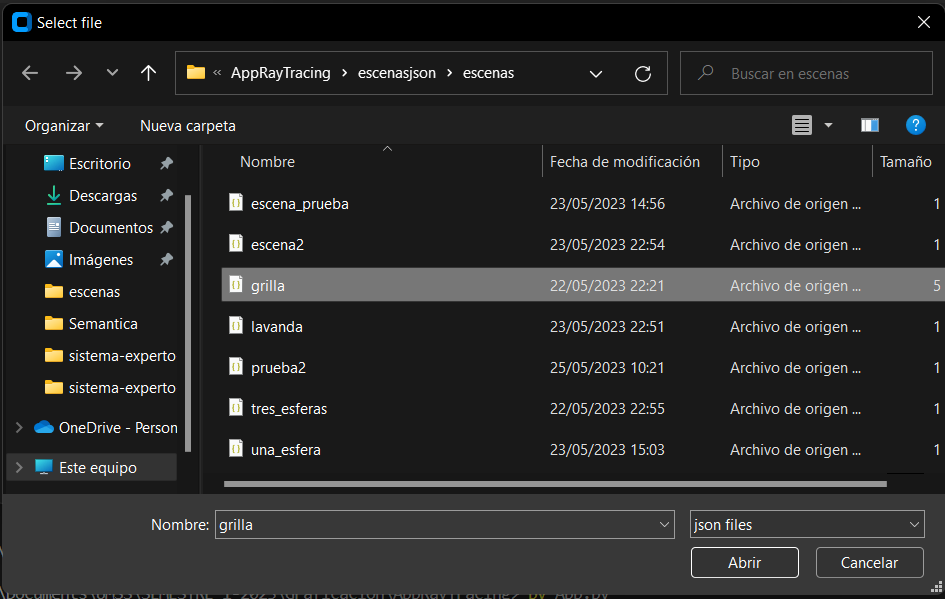
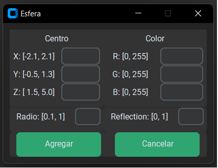

# app-ray-tracing
## Cargar Escena

Para cargar una escena haga click en el boton ***Cargar Escena***, esto abrira un explorar de archivos, donde se encuentrar escenas predefinidas.



Las escenas estan guardadas en formado **json**.

```json
{
  "esferas": [
      {
        "color": [1.0, 1.0, 0.0],
        "reflection": 0.7,
        "refraction": 1.0,
        "diffuse_c": 1.0,
        "specular_c": 1.0,
        "centro": [0.55, 0.1, 0.1],
        "radio": 0.3
      },
    ]
}
```
Elija una escena y **Abrir**, esto cargara la escena en el programa, para posteriormente ejecutar el algoritmo ***ray tracing***.
## Agregar Esferas

Para agregar una esfera, presione el boton ***Agregar Esfera**, esto abrira una ventana donde debe introducir las propiedades de la esfera.



***Nota: Debe respetar los rangos establecidos para cada valor.***

## Generar Escena

Luego de agregar las esferas que quiera, debe generar la escena, esto lo hace con el boton ***Generar Escena***, el cual le pedira que agregue un nombre a la escena para guardarla.

## Ejecutar RayTracing

